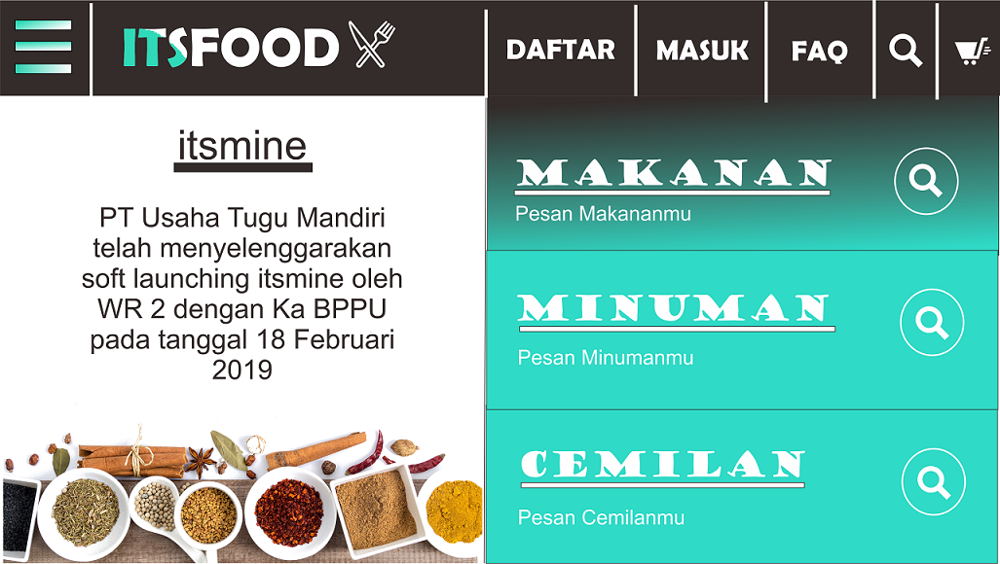

# Usability Evaluation and Prototyping (again)

## Operating the Prototype


High Fidelity Prototype Link Youtube
https://youtu.be/AiMd5t_Re90

---

## Part A: Usability Evaluation

### 1. Brief Description of Participants

#### a. Description of Participant 1
* The user is a female
* She is 21 years old
* She is a student in State Administration in Airlangga University
* She has experience using a website. There are for shopping, look her GPA on UNAIR website and do her homework.
* Why i choose her? because she is my informant in my assignment-1. She is a student in UNAIR and never have entered ITS, she doesnot know about itsfood.id

#### b. Description of Participant 2
* The user is a male
* He is 19 years old
* He is a student in Industrial Engineering in ITS
* He has experience using a website for do his homework, shopping ad read a commic.
* Why i choose him? because he is in first year od collage in ITS, and he has a little information about programming (from his lecture in Algoritma Pemrograman ), then he doesnot know about itsfood.id website.

### 2. Evaluation Script
<p>There are six instruction for the user. BEllow is the following instruction: </p>

* Try to register
* Try to login
* Try to find FAQ feature
* Try to search some food
* Try to find information about the contact and social media of itsfood.id
* Try to order some food

### 3. Transcript

#### a. Transcript with User 1

```
1.	Me   	: "Ini adalah sebuah prototype. Prototype itu kayak gambar tpi kita bisa klik. 
                   Kalo kita klik ini nanti pindah ke gambar lain. Jadi kita ga bisa input. 
                   kita cuma bisa klik tombol buat ganti gambar. Nanti aku kasih beberapa instruksi, 
                   kamu ngejalanin sesuai yang aku instruksiku. Kalo misal ada masalah, tombolnya susah 
                   dicari , tulisannya kurang jelas atau apapun tetang tampilannya kamu bilang aja."
2.	User1	:"Oke fhir!"
3.	Me	: "Oke. Langsung aja ke pertanyaannya. Pertama, Apakah kamu pernah memesan makanan atau minuman secara online?"
4.	User1	: "Pernah, pake grabfood."
5.	Me	   : "Cara mengoperasikannya gimana?"
6.	User1	: "Ya kamu pilih makanannya terus nunggu dapet driver. Trus nanti dianter dan dibeliin 
                   sama drivernya. Terus kita bayar pakai OVO atau tunai."
7.	Me	: "Apakah kamu pernah mencoba web itsfood.id?"
8.	User1	: "Pernah, dulu waktu kamu suruh review itu."
9.	Me	: "Terus kemaren gimana?"
10.	User1	: "Waktu itu, aku ga bisa bikin account atau masuk account disitu jadinya ga bisa order."
11.	Me	: "Oke. Yaudah sekarang ke instruksinya aja. Coba kamu bikin akun"
12.	User1	: "Oke. Klik tombol Daftar, trus ngisi Nama, Email, Password, Konfirm Password. trus klik Daftar"
13.	Me	: "Coba kamu Sign in"
14.	User1	: "Klik tombol Masuk. Ngisi input Email sama Password trus klik Masuk"
15.	Me	: "Coba kamu cari tau tentang Frequently Asked Question"
16.	User1	: "Klik tombol FAQ. Terus udah"
17.	(user terlihat berpikir)
18.	Me	: "Ada masalah kah?"
19.	User1	: "Kalo menurutku ya, ini design nya udah jelas sih. Kalimat buat menjelaskan cara pesan juga udah jelas. 
                   Trus design nya simpel."
20.	Me	: "Oke. Coba kamu cari tombol search biar kalo nyari makanan atau minuman atau cemilan biar cepat."
21.	User1	: "Klik tombol search, trus ngisi input . terus klik tombol ini"
22.	(user menunjuk tombol search)
23.	Me	: "Oke. Coba kamu cari informasi tenatng kontak dan social media dari itsfood.id"
24.	User1	: "Klik ini, trus klik Kontak, udah ini"
25.	Me	: "Oke, coba kamu order makanan, apa aja"
26.	(user terlihat bingung untuk mencari daftar menu yang bisa di klik untuk menambah)
27.	(user membuka halaman makanan)
28.	(user membuka halaman search)
29.	User1	: "ini bukan? oh bukan ya"
30.	(user kembali ke beranda home)
31.	(user scroll pada halaman beranda home)
32.	User1	: "Oh ini yaaa..."
33.	User1	: "Klik ini tambahkan. Semua menu?"
34.	Me	: "Ya terserah kamu"
35.	User	: "Oke"
36.	Me	: “Kok bisa lama tadi nemu makanan nya?”
37.	User1	: “Kalo menurutku ya, langsung aja di halaman makanan tu ada menu nya trus ditambahkan. 
                   Ini kan cuma di beranda aja (user menunjuk halaman home). Tapi, aku dapet maksudmu sih, 
                   ini kan cuma contoh. Tapi sebaiknya dikasih aja yang di halaman makanan , minuman sama cemilan. ”
38.	Me	: "Oke. Terus habis pesan makanan?"
39.	User1	: "Klik ini ya tombol troll, terus check out"
40.	(user melihat halaman data customer dan pesanan)
41.	User1	: "Kalo menurutku ya, di deket jumlah ini ada tombol buat nambah dan ngurangin ordernya. 
                   Jadi kita ga perlu kembali ke halaman pilih makanan buat nambah order."
42.	Me	: "Oke."
43.	User1	: "Terus klik Konfirmasi"
44.	Me	: "Oke terus menurutmu design ini gimana kalo dibandingin sama yang kemaren dan menurutmu secara keseluruhan?"
45.	User1	: "Menurutku sih kalo dari kemudahan akses, ini lebih mudah dioperasikan daripada yang kemaren. 
                   Terus tombol-tombolnya tuh kayak yang mudah dicari (user melihat halaman home)."
46.	Me	: "Okay makasih.."
```

#### b. Transcript with Participant 2

```
1.	Me   	: "Ini adalah sebuah prototype. Prototype itu kayak gambar tpi kita bisa klik. 
                   Kalo kita klik ini nanti pindah ke gambar lain. Jadi kita ga bisa input. 
                   kita cuma bisa klik tombol buat ganti gambar. Nanti aku kasih beberapa instruksi, 
                   kamu ngejalanin sesuai yang aku instruksiku. Kalo misal ada masalah, tombolnya susah 
                   dicari , tulisannya kurang jelas atau apapun tetang tampilannya kamu bilang aja."
2.	User2	:"Oke mbak."
3.	Me	: “Oke mulai ya . Untuk pertanyaan pertama, apakah kamu pernah memesan makanan secara online?”
4.	User2	: “Pernah.”
5.	Me	: “Pake apa? Gimana caranya?”
6.	User2	: “Pake Grab kalo gak Gojek. Kalo dari website cuma pernah liat di online shopping sih , 
                    kayak di tokopedia gitu. Tapi aku ga pesen , soalnya itukan cuma daerah Jakarta doang.”
7.	Me	: “Kamu tau gak website itsfood.id yang aslinya?”
8.	User2	: “Gatau, emang ada to mbak?”
9.	Me	: “Iya ada.”
10.	User2	: “Owalah, baru tau malah.”
11.	Me	: “Oke mulai instruksinya ya”
12.	Me	: “Yang pertama, coba kamu bikin akun”
13.	User2	: “ini klik daftar, terus ngisi ini ini, trus klik daftar”
14.	Me	: “okay, coba kamu sign in”
15.	User2	: “klik masuk trus ngisi email password, trus klik masuk.”
16.	Me	: “coba kamu cari informasi kayak gimana cara pesen makanan disini.”
17.	(user membuka halaman makanan)
18.	(user membuka halaman homepage)
19.	User2	: “Oh, aku tau, FAQ deng yaa”
20.	(user membuka halaman FAQ)
21.	Me	: “kok tadi kayak agak bingung nyari tombol FAQ nya kenapa?”
22.	User2	: “soalnya kalo misal aku pake suatu aplikasi atau website yang baru jarang sih liat halaman FAQ, 
                  jadi kalo menurutku ya mbak, ini jangan ditampilin di atas sini (user menunjuk bagian navbar pada home page), 
                  mending di tampilin di yang ini (user menunjuk dropdown menu). Kalo menurutku pribadi kayak kurang penting 
                  dan orang juga ga jarang yang buka halaman ini.”
23.	Me	: “Owalah gitu, oke. Coba kamu sekarang cari tombol search untuk cari makanan”
24.	User2	: “Klik tombol gambar search ini, terus ngisi nama makanan nya disini , terus klik tombol search ini. Udah gitu.”
25.	Me	: “Oke, terus sekarang coba kamu cari informasi tentang kontak dan social media dari itsfood.id”
26.	User2	: “Klik ini (user menunjuk ke tombol dropdown menu). Lalu klik Kontak. Udah ini mbak”
27.	Me	: “Coba kamu order makanan”
28.	(user membuka halaman makanan)
29.	(user kembali ke home page)
30.	User2	: “Oh ini, trus klik tambah, trus ada tulisan Pesanan Telah Ditambahkan.”
31.	(user berpikir sejenak)
32.	Me	: “Ada masalah? Apa yang lagi kamu pikirin?”
33.	User2	: “Menurutku ya mbak, ini kurang tombol cancel pesan gitu, kan bisa aja kalo kepencet, padahal aku 
                  ga mau pesan menu itu. Tapi juga bisa langsung ke tombol ini sih (user menunjuk tombol troll). Trus langsung check 
                  out. Trus konfirmasi. Udah gitu”
34.	Me	: “Oh iya ya.”
35.	(user melihat halaman data customer dan data pesanan)
36.	Me	: “Apa yang lagi kamu pikirin?”
37.	User2	: “Ini sih mbak , di bagian tabel yang data pesanan. Yang bagian atas ini ada menu, harga, jumlah , subtotal. 
                  Itu mending di blok jadi ada warnanya. Jadi lihatnya ga bingung.”
38.	Me	: "Menurutmu design ini secara keseluruhan?"
39.	User2	: “Ini yang tombol FAQ nya ditaruh ke ini aja (user menunjuk dropdown menu), biar yang di atas ini (navbar) ga terlalu penuh. 
                  Untuk tombol troll sama search nya udah bener sih. Trus untuk FAQ nya itu mending namanya diganti jadi ‘Cara Pesan’.”
40.	Me	: “Oke, ada lagi?”
41.	User2	: “Udah sih mbak, itu aja.”
42.	Me	: “Oke makasih ya”
43.	User2	: “Ya mbak sama-sama”

```

### 4. Feedback and Incidence Analysis
> Record your observations per prototype screen followed by reference, feedback, incidence, reason, and resolution.

#### OBSERVATION 1


 - **Reference**: Provide line-number(s) or time-code(s) referred by feedback/incidence observed on the screen.
 - **Feedback**: Provide feedback (positive or negative) given by the participants, if any.
 - **Incidence**: Critical incidences (breakdowns or problems encountered by the participants) and/or mistakes committed by the participants, if any.
 - **Reason**: Explain the reason for the breakdowns or the negative feedback observed on the screen.
 - **Resolution**: Suggest any modifications that might be made to the UI to address the issues in this `OBSERVATION 1`.
 
#### OBSERVATION 2


 - **Reference**: 
 - **Feedback**: 
 - **Incidence**: 
 - **Reason**: 
 - **Resolution**: Suggest any modifications that might be made to the UI to address the issues in this `OBSERVATION 2`.
 
#### OBSERVATION 3


 - **Reference**:  
 - **Feedback**: 
 - **Incidence**: 
 - **Reason**: 
 - **Resolution**: Suggest any modifications that might be made to the UI to address the issues in this `OBSERVATION 3`.
 
 ... and so on ...
 
 ---

## Part B: Prototyping (again)
> Next, you will need to modify your prototype 
> based on the resolutions you have suggested in `Feedback and Incidence Analysis`'s observations.

### Sketch
> Draw a sketch of your prototype that is refined based according to the aforementioned observations on a paper.
> Afterwards, scan the sketch or make the photograph of it and attach it on this report's section.
> Please make sure the any texts on the sketch are readable.


### Design Rationale
> Please write a paragraph expressing what you have learned from the usability evaluation, 
> and how it is reflected in your design.

### High-Fidelity Interactive-Prototype
> Create a high-fidelity interactive-prototype based on the `Sketch` you have drawn.
> You can use any prototyping tools: InVision, Adobe XD, or even Microsoft PowerPoint.
